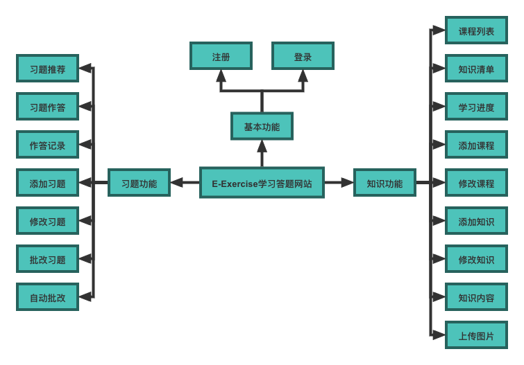
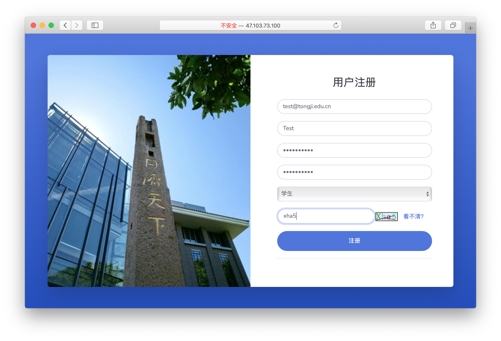
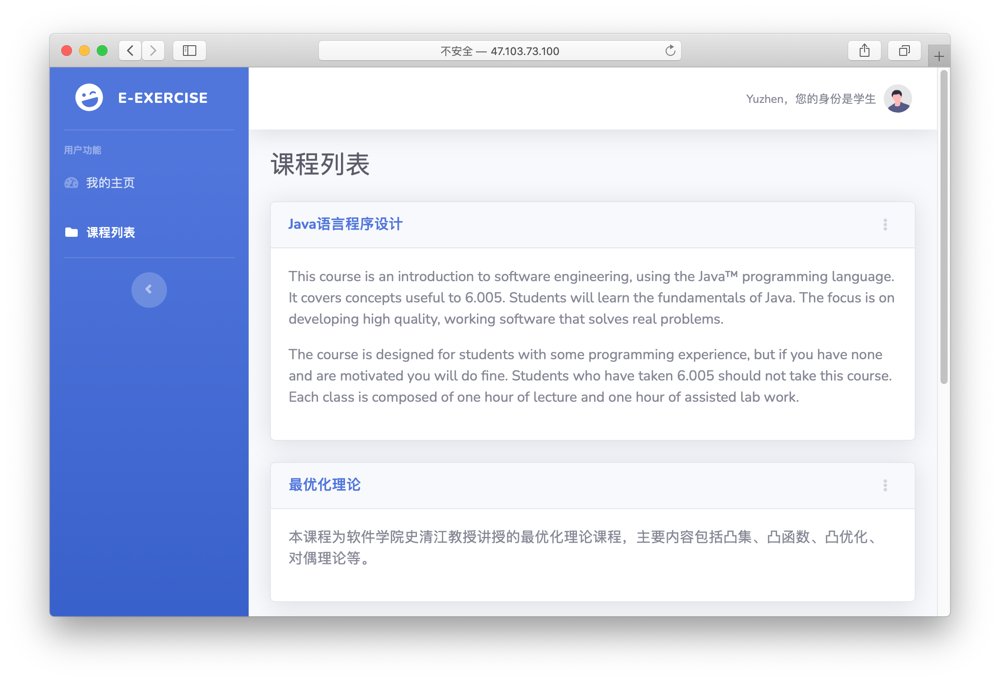
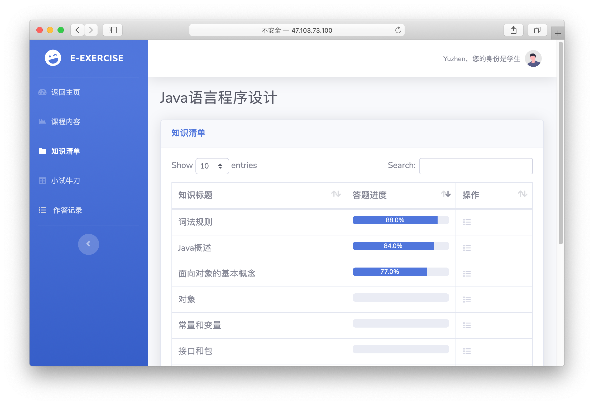
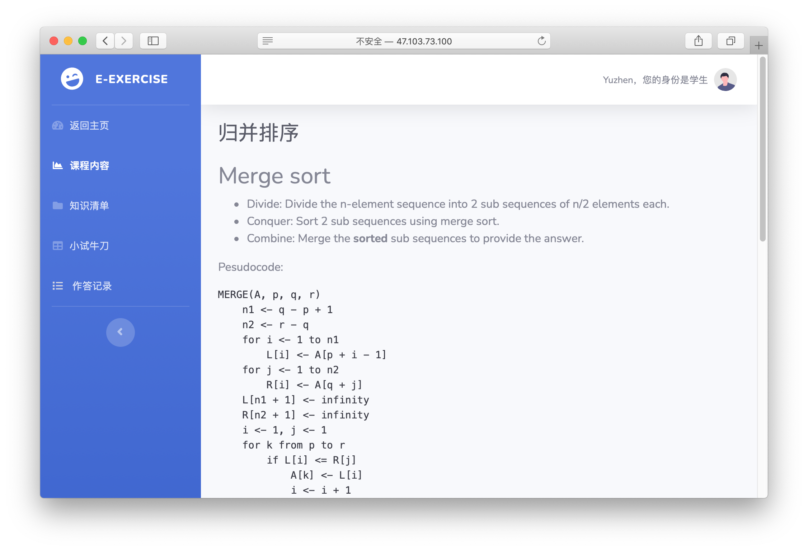
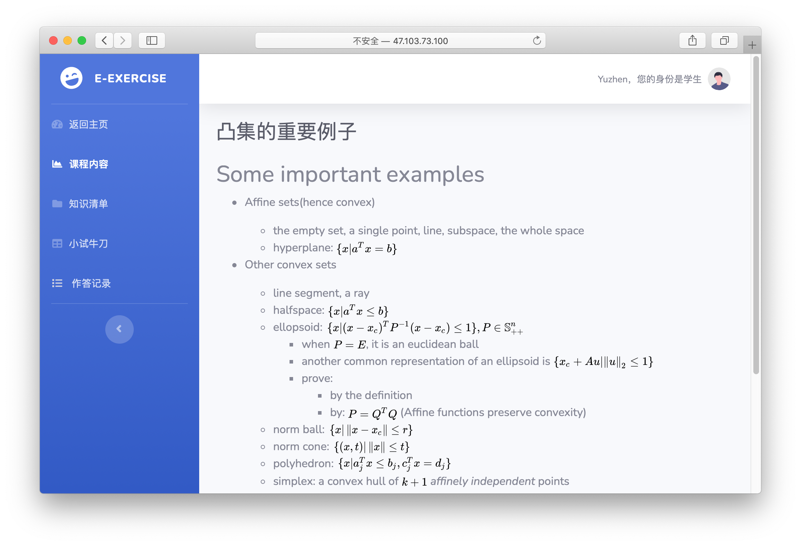
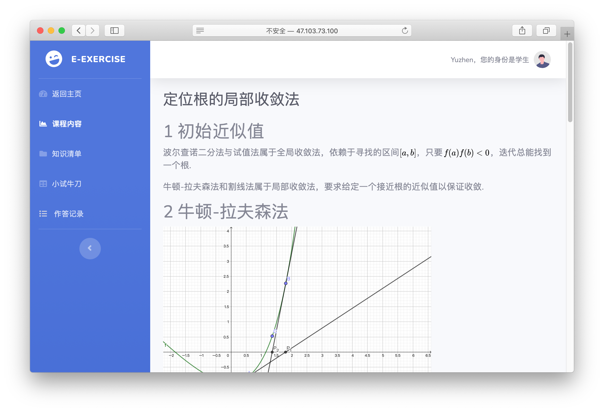

# Java课程作业集

本仓库中，`FinalProject`文件夹中是一个Spring Boot在线答题网站项目，`Homework-1`文件夹中是用C++完成的一个简单的词法分析器，`Homework-6`文件夹中是一个Spring Boot在线点餐网站项目。

该README文档仅对`FinalProject`文件夹中的内容进行介绍，具体可见`Report`文件夹中每一次的报告。

## E-Exercise学习答题网站

### 前言

本人使用Spring Boot+Thymeleaf+MyBatis框架实现了一个名为“E-Exercise”的学习答题网站，主要包括用户模块、知识模块和习题模块，并将其部署在云服务器上。在知识模块，实现了知识间依赖关系的构建，以Markdown标记语言作为知识模板；在习题模块，实现了习题作答、习题批改、习题推荐等功能，同时在原始Markdown语法的基础上，面向选择题拓展了该标记语言，使得用户能够较方便地添加习题。本网站没有采用XML标记语言作为知识和内容的模板，考虑到的是用户需求，因为不熟悉XML的用户较难使用，因此采用广受大众喜爱的简单易学的Markdown标记语言。本网站可以通过IP地址进行访问，登录界面的URL为http://47.103.73.100:8081/ExerciseOnline/user/toLogin。在答辩完成后本网站所有源代码将在GitHub上进行开源，遵循MIT License开源协议，网址为https://github.com/Feng-Yz/Java-Homework/tree/main/FinalProject/Exercise-Web-Online。

### 运行环境

经测试，该网站可以在如下运行环境中运行：

- Oracle JDK 14.0.2或OpenJDK 11.0.12（其他版本未进行测试）
- MySQL 5.7.34

### 附件说明

在`FinalProject`文件夹中，包括：

-  `eExercise`文件夹，其中是项目文件；

-  `ExerciseOnline-0.0.1-SNAPSHOT.jar`JAR包；

-  `eExercise.sql`SQL文件，其中包括新建表单、插入数据的SQL语句；

-  `eExercise_trigger.sql`SQL文件，其中包括新建触发器的SQL语句；

-  包含使用说明书的PDF文件；

-  包含大作业报告的PDF文件。

在`eExercise`文件夹中，包括：

-  Maven的`pom.xml`文件；

-  `src`文件夹，其中`main`文件夹中为本项目的主要内容，`test`文件夹中为测试代码（无需使用）。

`main`文件夹中`java/com/Yuzhen/ExerciseOnline/`的内容具体如下：

- `auxiliary/`：辅助类，主要包括一些辅助函数，例如：对知识和习题模板的处理、对上传文件重命名等；

- `entity/`：数据库实体类；

- `controller/`：控制器类，用于处理Http请求、配置URL映射等；

- `service/`：用于处理业务逻辑；

- `repository/`：用于数据访问的接口；

- `NoLoginException.java`：用于处理未登录异常；

- `GlobalExceptionHandleController.java`：用于处理其他异常；

- `ExerciseOnlineApplication.java`：主类。

`main`文件夹中`resources/`的内容具体如下：

- `application.properties`：应用程序的配置文件；

- `mappers/`：Mybatis的XML映射文件；

- `static/`：网页静态资源；

- `templates/`：网页模板。

### 功能说明


#### 功能总览



#### 基本功能

网站的基本功能包括用户注册、用户登录，另有验证码防止恶意行为。目前，网站并不允许用户自行注册为管理员与教师，只能注册为学生。注册时，系统会查看邮箱是否已经被注册。若已经被注册，则向前端返回警报。




#### 知识功能

对于学生用户来说，可以查看课程列表，进入课程页面后可以查看知识清单和具体知识内容，主页和知识清单页面都有学习进度的显示（主要依据答题情况）。





知识内容采用Markdown标记语言作为模板，前端可以对符合Markdown语法的内容进行渲染，包括：标题、代码、图片等；数学公式使用Zhihu提供的接口，将Tex公式转化为图片（也可使用MathJax，但是很丑陋，故抛弃）。







对于管理员与教师来说，可以添加课程、添加知识、修改课程、修改知识等。添加和修改知识时，可以为该知识增加前置依赖知识。为了服务管理员和教师书写知识的需要，本网站添加了“我的图库”功能，可以上传图片。图片上传后，通过Markdown或HTML的标记方式可以在知识中使用图片。例如，在知识中插入语句
```
  
```
即可在知识中插入图片。

#### 习题功能

对于学生用户来说，进入知识清单后可以查看对应知识的习题，也可以通过“小试牛刀”界面查看系统推荐的习题，。系统推荐习题的规则如下：
- 推荐过去完成的习题中最高分不超过85分的习题；
- 对于未产生进度的知识点，查看其前置依赖知识是否进度不低于75\%，若其前置知识存在低于75\%的，则不推荐；反之，则推荐；
- 对于产生进度的知识点，推荐其未做过的习题。

学生可以在该页面进行答题，对于简答题，提供文本框；而对于选择题和判断题，提供选择框进行选择。对于选择题和判断题，若添加习题时输入了答案，则系统会自行批改；其他情况交由教师批改。学生可在作答记录中查看自己的作答情况。

对于管理员与教师来说，可以添加习题、修改习题、批改习题。添加习题、修改习题的界面与添加、修改知识的界面大致相同，批改习题的界面与学生查看答题详情的页面类似，不同的是教师可以对成绩进行录入或修改。

习题内容也采用Markdown标记语言作为模板，在此基础上，还为选择题增添了标签。模板中用`<opt>`标记选择题的选项，例如：
```
  下列关于运行字节码文件的命令行参数的描述中，正确的是______。
  <opt>A.第一个命令行参数（紧跟命令字的参数）被存放在args[0]中
  <opt>B.第一个命令行参数被存放在args[1]中
  <opt>C.命令行的命令字被放在args[0]中
  <opt>D.数组args[]的大小与命令行参数的个数无关
```
此时，若有超过4个选项的习题，系统也能自动识别。
